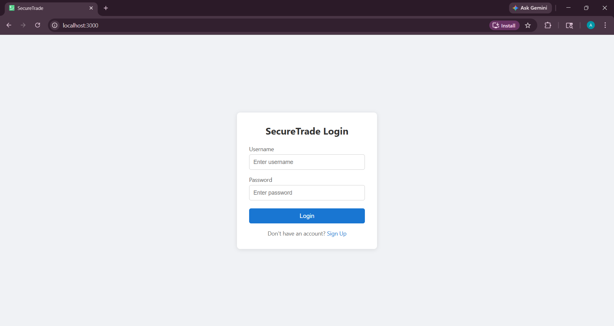
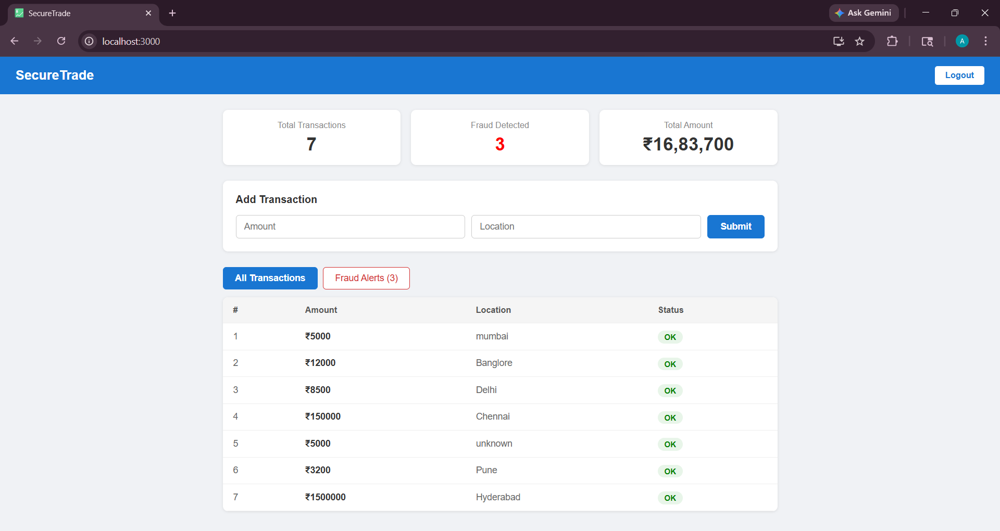
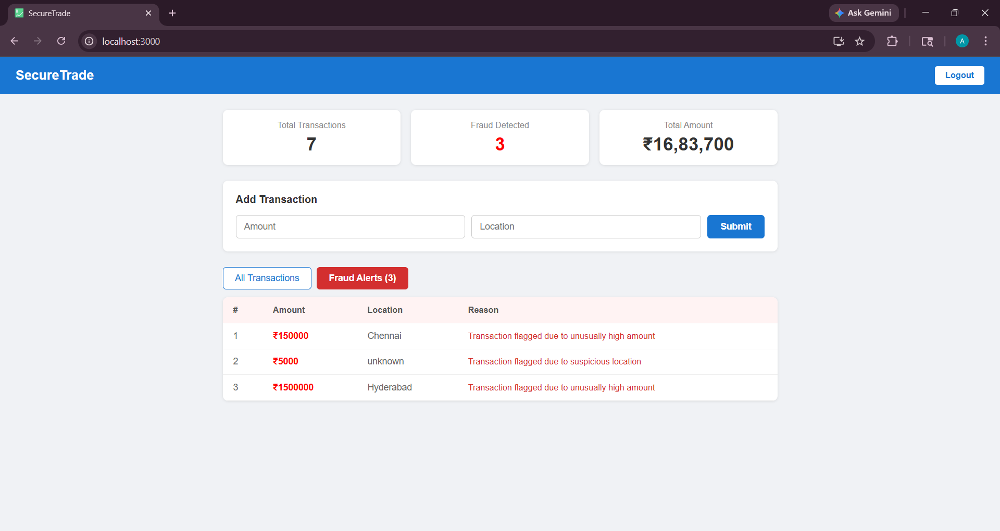

# SecureTrade - Fintech Fraud Detection System

A full-stack web application where users can create transactions and get real-time fraud alerts based on rule-based detection logic.

Built using **Java Spring Boot** (backend) and **React.js** (frontend).

---

## Features

- User Signup and Login with JWT authentication
- Passwords stored as BCrypt hashes (never plain text)
- Create transactions with amount and location
- Automatic fraud detection on every transaction
- View all transactions and fraud alerts on dashboard
- Each user can only see their own data

---

## Fraud Detection Rules

A transaction is flagged as fraud if any of these conditions are true:

- Amount is more than Rs. 1,00,000
- Same user has made more than 5 transactions
- Location is "Unknown"

---

## Tech Stack

**Backend**
- Java 21
- Spring Boot 3.2.5
- Spring Security (JWT authentication)
- Spring Data JPA + Hibernate
- MySQL

**Frontend**
- React.js
- Axios (for API calls)

**Tools**
- Maven
- Postman (for API testing)
- IntelliJ IDEA
- VS Code

---

## Project Structure

```
securetrade/
├── backend/
│   └── src/main/java/com/securetrade/
│       ├── config/
│       │   ├── CorsConfig.java
│       │   └── SecurityConfig.java
│       ├── controller/
│       │   ├── AuthController.java
│       │   └── TransactionController.java
│       ├── model/
│       │   ├── Transaction.java
│       │   └── User.java
│       ├── repository/
│       │   ├── TransactionRepository.java
│       │   └── UserRepository.java
│       ├── security/
│       │   ├── JwtFilter.java
│       │   └── JwtUtil.java
│       └── service/
│           ├── AiService.java
│           ├── FraudDetectionService.java
│           └── TransactionService.java
└── frontend/
    └── src/
        ├── App.jsx
        └── components/
            ├── Login.jsx
            ├── Signup.jsx
            └── Dashboard.jsx
```

---

## How to Run

### Prerequisites
- Java 21
- Node.js
- MySQL

### Step 1 - Set up the database

Open MySQL and run:

```sql
CREATE DATABASE securetrade;
```

### Step 2 - Configure backend

Open `src/main/resources/application.properties` and update:

```properties
spring.datasource.username=your_mysql_username
spring.datasource.password=your_mysql_password
```

### Step 3 - Run the backend

```bash
cd backend
mvn spring-boot:run
```

Backend will start on `http://localhost:8080`

### Step 4 - Run the frontend

```bash
cd frontend
npm install
npm start
```

Frontend will start on `http://localhost:3000`

---

## API Endpoints

| Method | Endpoint | Description | Auth Required |
|--------|----------|-------------|---------------|
| POST | /auth/signup | Register new user | No |
| POST | /auth/login | Login and get JWT token | No |
| POST | /api/transactions | Create a transaction | Yes |
| GET | /api/transactions | Get all transactions | Yes |
| GET | /api/fraud | Get fraud transactions | Yes |
| GET | /api/fraud/count | Get fraud count | Yes |

---

## Screenshots

> Login Page



> Dashboard



> Fraud Alerts



---

## Notes

- Make sure MySQL is running before starting the backend
- The JWT token expires after 1 hour, you will need to login again after that
- Do not push `application.properties` with your real password to GitHub

---


Aditya Sahu
- LinkedIn: [linkedin.com/in/aditya-sahu1444](https://linkedin.com/in/aditya-sahu1444)
- GitHub: [github.com/adityasahu0412](https://github.com/adityasahu0412)
